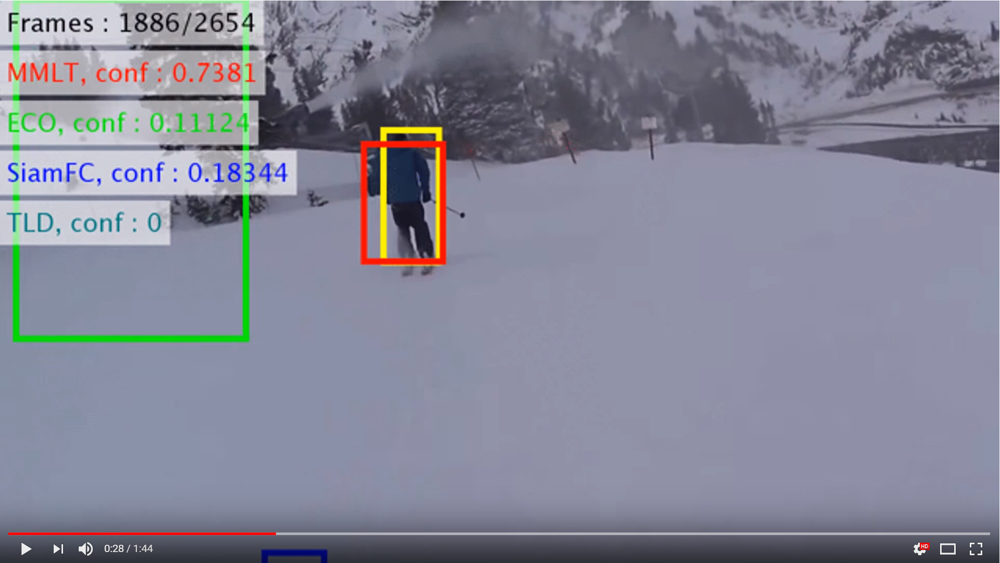

## A Memory Model based on the Siamese Network for Long-term Tracking (MMLT)

:trophy: **the 3rd prize winner of the VOT2018 long-term challenge**

----------
### Introduction

This is the research paper for the **ECCV workshop 2018** paper:

Hankyeol Lee*, [Seokeon choi*](https://sites.google.com/site/seokeonchoi), and Changick Kim, "**A Memory Model based on the Siamese Network for Long-term Tracking**", in Proc. ECCV workshop 2018.  (* *These two authors contributed equally*)

<**Overall flowchart**>

----------
### Abstract

We propose a novel memory model using deep convolutional features for long-term tracking to handle the challenging issues, including visual deformation or target disappearance. Our memory model is separated into short- and long-term stores inspired by Atkinson-Shiffrin Memory Model (ASMM). In the tracking step, the bounding box of the target is estimated by the Siamese features obtained from both memory stores to accommodate changes in the visual appearance of the target. In the re-detection step, we take features only in the long-term store to alleviate the drift problem. At this time, we adopt a coarse-to-fine strategy to detect the target in the entire image without the dependency of the previous position. In the end, we employ Regional Maximum Activation of Convolutions (R-MAC) as key criteria. Our tracker achieves an F-score of 0.52 on the LTB35 dataset, which is 0.04 higher than the performance of the state-of-the-art algorithm.

----------
### Usage 

This instructions are for Win10.

Pre-requisites : GPU (CPU is also available, but slow), CUDA (we used 8.0), cuDNN (we used 7.1), MATLAB (we used 2017a), MatConvNet (we used 1.0-beta25) 

1. Setting MatConvNet

* Download the MatConvNet and cuDNN in the "matconvnet" folder (http://www.vlfeat.org/matconvnet/)
* If you already have the MatConvNet, move it to these folders or change the direction at the "setup_paths.m" file.
 
2. Install
* Go to "/runfiles/" and run the m-file "install.m"

( The runfile automatically download the pretrained network (2016-08-17.net.mat) into the "pretrained" folder [http://www.robots.ox.ac.uk/~luca/siamese-fc.html] and the pretrained network (imagenet-vgg-verydeep-19.mat) into the "pretrained" folder [http://www.vlfeat.org/matconvnet/pretrained/] )

( The runfile also complie the matconvnet => GPU : vl_compilenn('enableGpu', true), CPU : vl_compilenn; )
  
( If cudnn and cuda are not available in your PC, it will be not operated. So Please cheack http://www.vlfeat.org/matconvnet/install/ )
 
3. Demo (It is not required for VOT integration, but try it for convenience)
* Go to "/runfiles/" and run the m-file "run_demo.m".
* If you want to do experiments by using other datasets, change the directory or move the dataset into the "sequences" folder

4. VOT Integration
* Go to "/runfiles/" and move the m-file "tracker_MMLT" to your VOT workspace
* Change the root_dir to the directory including the "MMLT" folder
* Run the m-file "run_test.m"
* Run the m-file "run_experiments.m"

If you get an error "gpuarray", check the readme file.

If you get an error "out of memory" on the GPU, increase p.gpu_memory_resize_add in setting_parameters.m file

----------
### Citation 

It has not been published yet.

----------
### Contact

If you have any questions, please feel free to contact seokeon@kaist.ac.kr

----------
### Acknowledgments

Many parts of this code are adopted from [SiameseFC](https://github.com/bertinetto/siamese-fc)

